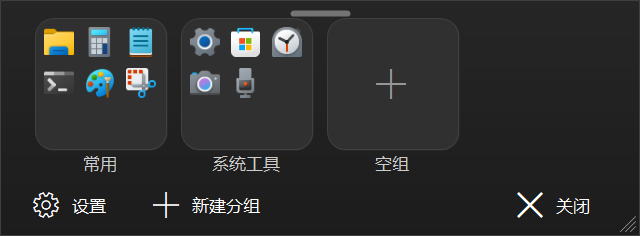
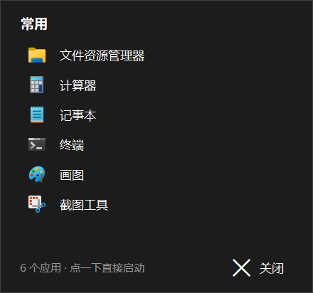

# BreadLauncher —— 一个长得像 Win11 开始菜单的小面板

一个单文件、零安装的 Windows 应用启动面板。双击就弹，点小图标直接启动，**面板能自己挪位置、拉大小并且都记得住**，**关掉就退出：没有托盘、没有后台进程、没有开机自启**。

界面主体是若干「大文件夹」：每个文件夹是一块圆角容器，里面铺 3×3 个小图标，**不用点进去，点哪个小图标就启动哪个**。

> **下载**：到 [Releases](../../releases/latest) 拿单文件 `BreadLauncher.exe`（免安装、不需要 .NET 运行时；首次运行 Windows 可能提示「SmartScreen」，点「更多信息」→「仍要运行」）。
> 想自己编译见 [第六节](#六重新编译)（一条命令，用系统自带 csc.exe，无第三方依赖）。



（截图里是 Windows 自带应用，用 `BreadLauncher.exe --preview 图.png 配置.json` 就能离屏渲染出这种图。）

---

## 一、怎么用

1. 双击 `build\BreadLauncher.exe`（也可以自己给它建个快捷方式，放到开始菜单或任务栏）。
2. **第一次打开**时，面板在**鼠标所在那块显示器**的工作区底部居中弹出（贴着任务栏上沿，再往上留一点点缝）；之后按你上次挪过 / 拉过的大小出现（位置和大小会被夹回**鼠标所在那块屏**的可视范围内，换显示器也不会跑到看不见的地方）。
3. 点大文件夹里的小图标 = 启动那个应用，**面板默认不关** —— 所以可以接着点下一个、连着启动好几个。想恢复「启动完就关面板」，去 设置（左下角齿轮）→ 点「**启动应用后：关闭面板**」。
4. 关面板**只由你自己触发**：底栏「关闭」、`Esc`（另外菜单里的「打开文件所在位置 / 打开软件所在文件夹」也会顺手关掉面板 —— 它们把你带到别处去了；设置里打开「启动应用后：关闭面板」之后，启动应用也会关）。**点面板空白处不关，切到别的窗口也不关。**
5. 面板可以自己挪、自己拉：**面板顶部正中有根小横条，那就是固定的拖动把手** —— 按住它拖 = 搬走整个面板（鼠标停上去它会变亮，光标变成四向箭头；可抓范围 120×12，比看起来那根条大得多，好点中）。想更随意也行，按住**空白处**拖同样是搬面板。拖**四边 / 四角** = 缩放（最小 360×220，不会超过屏幕可用区域）：**鼠标靠近哪条边，那条边就会亮一条蓝线**（面板没有边框，这是告诉你「可以拉这里」），**右下角还常驻一个三道斜线的拉伸手柄**，一眼就能看出这里能拉大小。位置和大小都记进 `settings.json`，下次打开还在原地。拖起来是**跟手 1:1** 的：鼠标在屏幕上走多少、面板就走多少，每个鼠标事件立刻响应（不做节流、不打折扣），松手时位置 / 大小精确落到你松手的那一点；**拖动和缩放期间会临时关掉半透明**以换取顺畅，松手立刻恢复原样。
6. 面板固定**置顶**，不会被别的窗口压住 —— 所以也不会再出现以前那种「面板被压住 → 点一下想把它点上来 → 结果自己关了 / 拖不动」。

> 面板关掉 = 进程退出，设置已经落盘，下次双击重新读。
> 重复双击不会开出第二个面板：程序是单实例的，第二次双击会把已经开着的面板叫到前面。

## 二、面板里的操作

**面板长这样**（示意图，不按比例）：

```
              ▬▬▬▬▬          ← 顶部正中：拖动把手（按住 = 搬走面板）
   ┌──────────────────────┐
   │  ┌──────┐  ┌──────┐  │
   │  │ ▫▫▫  │  │ ▫▫▫  │  │  ← 大文件夹：圆角容器 + 3×3 小图标
   │  │ ▫▫▫  │  │ ▫▫▫  │  │     点小图标 = 启动
   │  └──────┘  └──────┘  │
   │    常用      开发    │  ← 组名（居中在文件夹下方）
   │                      │
   │ 设置  新建分组   关闭 │  ← 底栏
   └──────────────────────┘
```

**一块「大文件夹」长这样**：圆角方块（容器）+ 3×3 宫格 + 容器下方居中显示组名。

- 空分组：容器正中显示一个「+」字形（Segoe MDL2 `\uE710`），点它就能往里加应用。
- 9 个以内：有几个显示几个图标，剩下的格子留白。
- **超过 9 个：文件夹内分页**，每页还是 3×3 共 9 格 —— 第 9 格就是第 9 个应用，**不再有「+N」格**。文件夹底部会画一排**页码小点**（当前页那颗亮、其余暗），**鼠标停在这个文件夹上滚滚轮 = 翻这一组的内页**。
- 想看整组清单（不翻页也行）：右键文件夹 →「查看全部（N）…」，见第三节。
- 分组顺序可以**直接用鼠标拖**：按住一个文件夹，拖到别的格子 / 另一个文件夹上 / 空白处松手，它就换到那个位置（拖动时来源压暗、落点描一圈强调色）。

| 操作 | 结果 |
|---|---|
| 左键点小图标 | 启动该应用（**默认不关面板**，可以接着点下一个；设置里可改成「启动后关面板」） |
| 左键点文件夹主体（图标之间的空隙、空格子、组名那一行） | 打开「添加应用」选择器 |
| 按住文件夹拖走 | 换分组顺序（落下时写盘）；从**图标**上起拖要移动超过 12px 才算拖动，所以不会吃掉「点一下启动」 |
| 右键点小图标 | 弹出一个菜单，**分成三块、块之间没有横线**（靠灰色标题分块）：<br>① **应用名**（灰色标题，点不动）→ 从「X」移除 / 移到其他分组（子菜单，第一项是「新建分组…」，后面才是现有分组）/ **名字常驻显示**（文字写明「已开启 / 已关闭」；开着时名字一直画在图标下面，不用悬停）/ **重命名…**（起个你自己的名字，留空恢复原名）/ 打开文件所在位置（仅真实文件）/ 复制显示名<br>② **「X」文件夹**（灰色标题）→ 添加应用… / 查看全部（N）…（空分组没有这项）/ 重命名分组… / 左移一位 / 右移一位 / 删除分组<br>③ **面板**（灰色标题）→ 刷新应用列表 |
| 右键点格子背景（图标之间的缝、组名那一行） | **同一个菜单**，只是**没有最上面那段应用项** —— 文件夹和面板那两块照常都在。所以点得准不准都能管理分组，不用去瞄小图标 |
| 鼠标**停在小图标上** | 浮出一条**完整应用名**（有自定义名就显示自定义名）；可在**设置菜单里关掉**（「鼠标悬停显示名字」） |
| 右键点面板空白处 | 新建分组… / 刷新应用列表 |
| 左键点一下面板空白处 | **什么都不做**（原来的「点空白关闭」已经去掉） |
| 按住**顶部正中那根小横条**（固定把手）拖动 | 搬走整个面板（**这是给「想拖面板」准备的固定位置**；鼠标停上去把手变亮、光标变四向箭头）。可抓范围 120×12、从顶部往下 6px 起、下沿正好收在分组区上沿（不会吃掉第一行文件夹的点击）；它**和顶部那条 14px 的「拉边框缩放」带是重叠的**，靠「按在把手上就优先当搬面板」的判定顺序分开 |
| 按住面板空白处拖动 | 也能搬走整个面板（兜底用法）；位置同样记进 `settings.json`，下次打开还在原地 |
| 拖面板的四边 / 四角 | 缩放面板（光标变成双向箭头）；最小 360×220，最大不超过屏幕可用区域，大小也会记住。面板没有边框，所以**拖动 / 缩放的时候那条边会亮一下**，让你知道正抓着哪条边（平时鼠标停在面板空白处是**穿透到下面窗口**的，不会亮 —— 那是亚克力半透明的正常表现） |
| 滚轮（停在某个文件夹上） | 这组超过 9 个时**翻这一组的内页**（高精度滚轮 / 触控板的小幅滚动会先攒着，**攒够一格才翻一页**，不会一次滑动就把这组从头翻到尾）；翻到第一页 / 最后一页还继续滚，就落回整片分组区的滚动 —— 两层不会互相卡住 |
| 滚轮（不在文件夹上） | 分组一屏放不下时上下翻：**一整格滚轮 = 正好一行文件夹**（不会把一排格子切成半截）；高精度滚轮 / 触控板送来的小幅滚动按比例缩（这种小碎步会停在半行，是为了跟手，不是没反应）。右侧那条手画的细滚动条是 4px 宽、离右边缘 3px，**只显示位置**：不能拖、点了也不翻页，更不会把面板拉大 |
| 点到别的窗口 / 面板被盖住 | 面板**不会关**（它是置顶窗口，盖不住；也没有「失去焦点自动关」这回事了）—— 要关就用底栏「关闭」或 `Esc` |
| `Esc` | 关闭面板 |

> 按下去之后**移动不超过 3px 才算「点击」**：所以想拖面板 / 拖分组的时候，不会顺手把应用启动了、也不会弹出菜单。

底栏三个按钮：**设置**（左下角齿轮）、**新建分组**、**关闭**。

几点约定：

- 「添加应用」是个深色模态框，**勾选式多选**：左上角是标题「添加应用到「组名」」，**右上角并排显示「已有 N 个 · 已选 M 个」**（选好之后还会多一句「本次 +N」）；下面一行左边是筛选框（输入名字即时过滤），**右边三个按钮：**「来源：桌面 ▾」「全选」「全不选」****；中间是应用列表，**每行右边有一个方框，点一下打钩、再点一下取消**。勾好之后按右下角的 **「添加 N」** 把它们一次全加进来（**窗口不关**，加过的条目会从候选列表里消失，可以接着挑），挑完按左下角 **「完成」** 关窗。`Esc` 也等于完成，回车等于按一次「添加 N」。左下角那行小字是随状态变的提示，并且**带数量**（例如「桌面上有的应用 88 个（点按钮可看全部 175 个）」「全部应用 175 个（点『全选』可一次勾完）」「已选 3 个，点『添加』加进来」）。列表只列出还没进任何分组的应用，因为**一个应用同时只属于一个分组**：往新分组里加，会自动从原分组移走。
- **「全选」勾的是「当前筛出来的那些」，不是全部候选** —— 所以可以和筛选框配合：先输入 `chrome` 筛出来，再点「全选」，一次就能把它们全加进来。**「全不选」清掉的同样是「当前筛出来的那些」**（和「全选」对称）：如果你先勾了 3 个、再换个筛选词，那 3 个**还是勾着的**，「全不选」不会替你清掉它们 —— 想全清就先清空筛选框再点。想一次加完桌面上那一批，就先保持默认的「来源：桌面」，点「全选」，再点「添加 N」。
- **还能「框选」**：在列表里**按住左键拖出一个方框**，**框到哪几行，那几行就自动打钩**（拖的时候能看到半透明方框，被框到的行会高亮），松手之后再按「添加 N」一起进组。和「全选」的区别：**全选是整个筛选结果，框选是你自己框到的那一片**；框选同样可以先配合筛选框（先筛一部分、再框）。**按下后每个方向移动不超过 5px 仍按「点一下」处理**（打钩 / 再点取消打钩），所以手抖不会误框。
- **在列表里右键一行会弹出一个小菜单**：「打钩 / 取消打钩」（跟着当前状态两态切换，和左键点一下走的是同一条路，标题上的「已选 N 个」和按钮上的「添加 N」会立刻跟着变）、「打开文件所在位置」（**只有这个条目是真实文件时才有这一项**）、「**名字常驻显示**（画在图标下）」、「**重命名…**」（起个你自己的名字）、「**复制显示名**」。**这份菜单里故意没有「启动」** —— 选择器是用来挑应用的，右键顺手启动一个应用容易误触（「查看全部」窗口那份菜单里才有「启动」）。点「打开文件所在位置」**不会关掉选择器**（已经勾好的不会被作废），只是左下角那行提示变成「已经在资源管理器里定位到「某某」」。
- **列表从哪里来：「来源」按钮**（筛选框右边那个「来源：桌面 ▾」）。点一下展开，里面是三项 + 一条管理入口：
  - **桌面**（默认）：只列「桌面上有快捷方式」的应用，名字后面带灰色「桌面」小字 —— 你自己装、自己在用的基本都在这儿，先从这里挑最省事。
  - **全部（含开始菜单）**：把扫描到的都列出来，包括计算器 / 设置 / 终端 / 截图工具 / Microsoft Store / 记事本 / 文件资源管理器这类**桌面上通常没有快捷方式的 Windows 自带应用**。
  - **自定义文件夹**：只列你自己加的那些文件夹里扫到的应用。
  - **管理自定义文件夹…**：打开一个小窗口，**「添加文件夹…」选目录、「移除」删掉**。加进来的每个文件夹会扫**它自己 + 一级子文件夹**，只认 **`.lnk` / `.exe` / `.url`**（不会把图片、文档、压缩包也捞进来；也**不会递归到底** —— 有些目录递归下去上万项，又慢又乱）。加完会自动切到「自定义文件夹」视图，你能立刻看到扫到了什么。这些目录记在 `settings.json` 的 `ScanDirs` 里，下次打开还在。
  - 按钮上的字永远显示**当前用的是哪个来源**（`来源：桌面` / `来源：全部` / `来源：自定义`），一眼看得出状态。
- **设置菜单（左下角齿轮）里的开关，打勾 + 文字都表示「当前状态」**：「亚克力半透明（空白处会穿透鼠标）：已开启」「鼠标悬停显示名字：已关闭」「启动应用后关闭面板：已关闭」——看到「已开启」就是现在开着，点一下变「已关闭」。**不是**「点一下会发生什么」，别弄混。
- **半透明（亚克力）的代价，我说清楚**：面板"透出桌面"必须把背景交给系统挖空，而**被挖空的那块连鼠标一起穿透** —— 也就是「鼠标停在面板空白处滚滚轮，结果滚的是下面的应用」。**默认就是开着亚克力（好看优先）**，代价直接写在设置菜单那一条的字里：「亚克力半透明（空白处会穿透鼠标）」—— **不弹窗提醒**（软件打开时也不会弹任何提示框）。**介意误触就把「亚克力半透明」关掉** —— 面板变成不透明窗口，**完全不穿透**（实测：关掉亚克力时空白处 3/3 个点都命中面板自己）。
- 菜单、对话框、「关于」弹着的时候，面板都老老实实待着；**关面板现在只由你主动触发**（空白处、别的窗口都关不掉它）。
- 删除分组会弹一次确认框，并说明「组里的应用会回到未分组，不会卸载任何东西」；其余操作都不弹确认。
- **小图标上没有「新增」角标**：那个蓝色的「新增」小字只画在列表里，也就是「添加应用」选择器和「查看全部」窗口。

## 三、「查看全部」窗口



文件夹里一次只摊开 3×3 九格，超过 9 个就要翻页；想一眼看完整的组，就**右键文件夹 →「查看全部（N）…」**（所有非空分组都有这一项）。**组里的每一个应用都能在这里点到**。（以前靠第 9 格的「+N」格进这个窗口，现在那个格子已经是第 9 个应用本身了。）

- 按**组内顺序**列出这个分组的**全部**应用，带图标；条目多时用自绘的 4px 细滚动条滚动（**可以拖**，滚轮一格滚 3 行，点轨道空白处也能翻页 —— 翻的是「一屏减一行」，和 Windows 一样，还留着一行让你看得出翻到哪儿了）。这条滚动条的宽窄、离右边缘的距离跟面板那条**是同一套数字**（墨水 4px、距右缘 3px），不会再一个窗口一个样。
- **左键点一行 = 启动该应用**（和点小图标一样；**默认不关面板**，除非在设置里打开「启动应用后：关闭面板」）。
- 右键点一行：启动 / 从「X」移除 / 名字常驻显示（画在图标下）/ 重命名… / 打开文件所在位置（仅真实文件）/ 复制显示名。
- 「从「X」移除」**当场写回 `settings.json`**，并立刻刷新后面的面板，不用关窗口再手动刷新。
- `Esc`、右下角「关闭」、或点到别的地方 = 返回面板，什么都不做。
- 窗口高度按条目数长高，最多先显示 8 行，再多就在窗口里滚动；空分组显示「这个分组还没有应用」。
- **想让名字一直看得见**：右键应用 →「**名字常驻显示**」，勾上后它的名字就固定画在图标下面（格子只有 40 来像素宽，一行放不下会用「…」，鼠标停上去仍能看全名）。它和「悬停显示名字」是两件事：常驻是**逐个应用**勾的、一直显示；悬停是全局开关、只在鼠标停上去时显示。
- **应用可以起自定义名字**：右键小图标 / 「查看全部」里的一行 / 选择器里的一行 →「重命名…」，输入你喜欢的名字（留空 = 恢复原名）。名字**跨分组、跨重启都生效**，存在配置里；所有显示名字的地方（查看全部列表、选择器、悬停提示、复制名字、`--launch` 名字匹配）都用它。**只改显示名，不影响扫描/去重/启动**。
- **「查看全部」里可以拖动换顺序**：按住一行**上下拖**，会出现一条青色插入线（告诉你「会插到这儿」），松手就按那个位置排；**不拖动、只是点一下仍然是「启动这个应用」**（阈值 6 像素，手抖不会误搬）。顺序存在分组配置里，下次打开还是这个顺序；长列表拖到上/下边缘会自动滚。
- 列表里 7 天内第一次出现的应用会带一个蓝色的「新增」小字；桌面上有快捷方式的条目会带一个灰色的「桌面」小字（和「添加应用」选择器里的规则一样）。

## 四、设置（左下角齿轮）

点左下角的齿轮按钮会**向上弹出一个下拉菜单**（不是一块常驻设置面板）：

| 菜单项 | 说明 |
|---|---|
| 刷新应用列表 | 忽略缓存重新扫描（刚装了新软件就点这个） |
| 亚克力半透明（空白处会穿透鼠标）：已开启 / 已关闭 | **默认开启** —— 面板一打开就是透出桌面的效果。开启后先试系统的「亚克力模糊」，不行再试普通模糊。**两种都不支持时：主动退回不透明**（纯深色底，`TransparencyKey` 清空，不再挖空）—— 你会看到一块普通深色面板，**不会**出现"看不见的半透明"，而且这一条的文字会如实变成「**亚克力半透明（这台系统不支持，面板保持不透明）：已开启**」。★另一种情况是**调用成功、但系统没真渲染**：那时才会保持"挖空 + 透出后面"的样子（这种没法检测，只能看观感）。代价是**被挖空的那块连鼠标一起穿透** —— 这条写在菜单文字里，**不弹窗** |
| 鼠标悬停显示名字：已开启 / 已关闭 | **默认开启**：鼠标停在小图标上会浮出完整应用名（有自定义名就显示自定义名）；想安静点可以关掉。单个应用还能右键勾「名字常驻显示」，那个是一直画在图标下面 |
| 文件夹大小 | 子菜单三项：**小（85%）/ 标准（100%）/ 大（120%）**，当前那一项后面标着「（当前）」 |
| 启动应用后关闭面板：已开启 / 已关闭 | 点一下切换。**默认「已关闭」** = 启动后不关面板（可以连着启动好几个）。菜单文字和左边的勾都表示**当前状态** |
| 清除图标缓存 | 删掉 `build\cache\icons\` 里的 PNG，重新取一遍。**程序换过取图逻辑之后要清一次**，否则缓存里的旧图（比如以前的通用白纸图标）还会被继续用 |
| 打开软件所在文件夹 | 打开 exe 所在的 `build\` 目录（打开后关闭面板） |
| 关于 BreadLauncher | 版本号、数据目录等一句话说明 |

菜单里**没有**「列表 / 网格视图切换」这类选项；面板就一种形态（大文件夹宫格）。

## 五、关于「固定到任务栏 / 开始菜单」

**这一条 Windows 没有给第三方程序留静默接口**，实测过：

- 开始菜单的固定项由系统组件管理，第三方程序没有可用的公开 API；
- 任务栏固定同样没有公开 API，微软从 Win10 起就收紧了。

所以要固定到系统任务栏 / 开始菜单，**得你自己右键那个应用「固定到任务栏」一次**。BreadLauncher 自己的分组是软件内部的分类，**和系统开始菜单的「已固定」区没有任何关系**，也不会有任何后台驻留。

## 六、重新编译

零依赖，只用系统自带的 .NET Framework 4 编译器，不需要联网、不需要 NuGet：

```bat
编译-零安装.cmd
```

它会调用 `C:\Windows\Microsoft.NET\Framework64\v4.0.30319\csc.exe` 把 `src\*.cs` 编到 `build\BreadLauncher.exe`；`assets\BreadLauncher.ico` 丢了会用 `tools\MakeIcon.cs` 现场生成一张多尺寸图标。

手动编译的等价命令（在工程根目录里执行；命令里保留 **`/codepage:65001`** 这个显式写法）：

```bat
C:\Windows\Microsoft.NET\Framework64\v4.0.30319\csc.exe /nologo /target:winexe /platform:x64 /optimize+ /codepage:65001 ^
  "/win32manifest:app.manifest" "/win32icon:assets\BreadLauncher.ico" ^
  "/out:build\BreadLauncher.exe" ^
  /reference:System.dll,System.Core.dll,System.Drawing.dll,System.Windows.Forms.dll,System.Web.Extensions.dll ^
  src\*.cs
```

PowerShell 里同一行（路径带空格、参数用引号更稳）：

```powershell
& C:\Windows\Microsoft.NET\Framework64\v4.0.30319\csc.exe /nologo /target:winexe /platform:x64 /optimize+ /codepage:65001 "/win32manifest:app.manifest" "/win32icon:assets\BreadLauncher.ico" "/out:build\BreadLauncher.exe" /reference:System.dll,System.Core.dll,System.Drawing.dll,System.Windows.Forms.dll,System.Web.Extensions.dll src\*.cs
```

编完直接跑：`运行.cmd`（它只启动已经编好的 `build\BreadLauncher.exe`，**不会重新编译**）。

> 关于 `/codepage:65001`：本机独立验收实测（报告属本机证据，不随仓库发布）**不带它也能编译成功**，产出的 exe 跑 `--scan` 的输出与带它时**逐字节相同**；反过来，显式写 `/codepage:936` 才会 exit 1 并报一大堆错。13 个 `.cs` 都没有 BOM。所以这个开关的作用是「把『按 UTF-8 读源码』写明确」，保留它、别乱改，但也别以为不加就编译不过。

## 七、数据与隐私

- 所有数据都在**软件自己的目录里**（`build\`），不写 `%AppData%`、不写 `%TEMP%`、不往 C 盘写任何东西；程序里**没有一句注册表代码**（Windows 自己会为运行过的程序维护跳转列表 / MRU，任何 exe 都一样，那不是本程序写的）。列表里能看到「注册表编辑器」「ODBC 数据源」「性能监视器」这类条目，是因为**它们本来就是 Windows 开始菜单自带的管理工具**（`shell:AppsFolder` 里的正式条目），**不是本程序去读注册表找出来的**。
- `build\settings.json`：分组（组名 + 成员顺序）、每个应用首次见到的时间、亚克力开关、文件夹大小、**面板位置和大小**（`PanelX/PanelY/PanelW/PanelH`：位置是屏幕坐标，大小是像素；高度没手动拉过就留 0，表示按分组数量自动收紧）、是否已经预置过。另外还留着两个**旧字段** `Pinned` / `GridMode` 兼容老配置：`Pinned` 只用来把老版本的固定项迁移成一个「常用」分组，`GridMode` 现在没有任何界面会写它。
- `build\settings.json.prev`：**上一次真正改动之前的配置**。只有配置**真的变了**才会重写它 —— 光是开关面板、什么都没动过，它不会被覆盖（不然你删错分组之后再关面板，这份备份就被"删之后"的版本顶掉了）。误删了分组、或不小心把组清空了，可以关掉面板、把 `.prev` 改名成 `settings.json` 再打开，就能回到上一版。
- `build\cache\apps-cache.json`：扫描结果缓存，**12 小时**过期；过期后下次打开面板先秒开旧的、再后台刷新一次
- `build\cache\icons\`：图标 PNG 缓存。文件名 = `MD5(缓存版本|应用Key|像素尺寸[|图标来源])` —— 第三段「图标来源」**只在条目有真实图标来源时才拼**（`.url` 里的 `IconFile=`、同名 `.lnk`）；缓存版本现在是 `v2`，**改动取图逻辑时必须一起 +1**（否则老缓存里的坏图会被一直复用），图标目录里的 `.iconver` 版本戳负责在升级时把上一版残留清掉
- **图标是从哪来的**（按优先级）：① 条目有「真实图标来源」就先用它 —— 桌面上那个 `.url` 快捷方式里写的 `IconFile=`（Steam 游戏就是这种），或者同名 `.lnk`；② 没有来源（或来源失效）才去问系统：真实文件按文件取图，UWP / 协议项按 `shell:AppsFolder\<AUMID>` 取；③ 再取不到就**不再拿系统那张「未知文件类型」的通用图顶替**（那个兜底已经删掉）—— 直接返回「没有」，界面改画**首字母色块**：按名字取色的圆角块 + 首字母（英文 / 数字取大写首字符，中文取第一个字）；而且就算取到了图，只要被判定成「通用白纸」或「彩色乱码」也算没取到。所以面板和列表里**不会再出现那张白纸图**；看到彩色首字母块，就代表**这个软件在系统里确实没有可用图标**（比如 Office 的几个小工具，快捷方式里的图标指向 ClickToRun 虚拟化路径，磁盘上并不存在），**不是面板出错**。顺带一提：**Steam 游戏以前会因为取图顺序的 bug 全部显示成那张白纸，现在已经修好**；升级后如果还看到旧的白纸图，用「设置 → 清除图标缓存」清一次即可。
- `build\cache\log.txt`：排查用日志（扫描耗时、取图失败等）

写盘的几条硬规矩（都是代码里做掉的，不用你操心）：

- **原子写**：先写一个唯一名字的临时文件（`settings.json.<序号>.tmp`），再用 `File.Replace` 顶上原文件 —— 在 NTFS 上这是元数据级替换，不存在「原文件删了、新文件还没改名就断电」的空窗。**个别文件系统（FAT32、网络盘）不支持 `File.Replace`**，会退回「删 + 改名」，那个窗口是真实存在的；代码对此的兜底是：删之前先留一份 `.prev`，万一改名也失败，就把那份临时文件**保留下来**（里面有最新配置，日志里写了路径，可以手工改回 `settings.json`），绝不静默清掉。
- **内容没变就不写盘**：开关面板都会触发一次保存，但内容一字未变时直接跳过 —— 不重写文件、也不动 `.prev`（那才是「上一版」）。所以你开开关关多少次，后悔药都还在。
- **写不进去也不崩**：只读目录、满盘、被杀软占着 —— 这类情况这次没存上而已（不抛异常），面板照常能开、能用。**没存上会留痕**：设置 →「关于 BreadLauncher」里会写出原因；一切正常时那里显示「配置保存：正常。」。只读目录连「常用」分组都预置不下去时，下次启动会再预置一遍（预置标记只在盘上确实正确之后才置位）。
- **配置读坏了**：原文尽量备份成 `settings.json.bad`、记一条日志、并弹一次提示，然后按默认设置启动；万一连备份都写不出去，程序会**停止写这一个文件**（别的文件照常写 —— 缓存文件坏了不该连分组一起禁写），免得用默认值覆盖掉你唯一那份数据。
- 「常用」分组只在**第一次运行**预置一次（而且只在确实写盘成功之后才算数），你删掉它就不会自己回来。

想恢复出厂状态：**`build\settings.json` 和整个 `build\cache\` 都要删**。只删缓存不够 —— 分组还留在 `settings.json` 里，而且「已经预置过」那个标记还是 true，删掉的「常用」分组不会自己回来。

## 八、自检命令（排查问题用）

最常用的三条（**都不弹面板、也不改你的分组**；完整清单、会写哪些文件、注意事项见 [`docs/selfcheck.md`](docs/selfcheck.md)）：

```bat
build\BreadLauncher.exe --scan                       列出扫描到多少应用、分组统计、前 40 条
build\BreadLauncher.exe --preview 图.png [settings.json]   离屏渲染一张面板图（检查排版）
build\BreadLauncher.exe --previewall 图.png 0 [settings.json]   渲染「查看全部」窗口
```

## 九、已知限制

1. **组内顺序不能调**：一个分组里的先后就是加入顺序（新加的应用排在组尾），所以「第 2 页」是按加入顺序排的，不是按名字。**分组之间的顺序可以**：用鼠标把文件夹拖到别的位置，或者右键「左移一位 / 右移一位」。
2. 文件夹内分页是**每页固定 3×3 = 9 格**，不是连续滚动：最后一页可能只有两三个图标，其余格子留白（不会把别的东西补进来）。
3. 面板出现在**鼠标所在那块显示器**的工作区底部居中（存过位置之后也仍然按这块屏夹回可视范围，免得换显示器后跑到看不见的地方）；没有做「指定某块屏」「每屏一份」这类多屏适配。
4. 面板固定**置顶**（TopMost）：始终浮在别的窗口上面，**不会被压住**，也不需要你手动去点它来「置顶」。以前那种「点一下没反应 / 点一下就没了 / 拖不动」的根因就是旧的「失去焦点自动关」——**那个行为已经删掉了**，关面板只由你主动触发（底栏「关闭」/ `Esc`；启动应用之后是否关面板，由设置里那一项决定，**默认不关**）。
5. 应用列表 = **一次 `shell:AppsFolder` 枚举**（资源管理器「所有应用」里的那些：UWP + 带快捷方式的传统程序）**＋ 桌面快捷方式**：用户 / 全局桌面上有 `.lnk`/`.url` 的，既会打上「桌面」标记、排到选择器最前面，**桌面上有而 AppsFolder 里没有的还会直接按快捷方式本身建一个条目**（否则这类应用根本扫不出来）。桌面目录按**顶层 + 一级子文件夹**扫（不递归，免得把桌面上动辄上万项的素材目录也捞进来）；而且**桌面上的条目只按「文件夹 / 文档」排除，不套开始菜单那套名字噪声规则** —— 用户放到桌面的就是他要的，像 `HiBit Uninstaller` 这种名字里带「卸载」的桌面快捷方式以前会被误杀，现在正常出现。开始菜单目录和桌面目录同时也用来给条目补「真实图标来源」（`.url` 里的 `IconFile=`、同名 `.lnk`，以及 `Microsoft.AutoGenerated.*` 条目的 `System.Link.TargetParsingPath`）。**绿色软件如果桌面上没有快捷方式、也不在 AppsFolder 里，面板还是扫不到它。** 另外，「添加应用」选择器**打开时「来源」默认是「桌面」**（只列候选里带「桌面」标记的那部分；点「来源」可以切到「全部（含开始菜单）」或「自定义文件夹」）—— 这只是默认筛选，候选本身还是上面这个全集。
6. 亚克力半透明依赖系统支持：代码只尝试「亚克力模糊 → 普通模糊」两级，**都不支持就主动退回不透明**（纯深色面板）。它也不是 Win11 真正的云母（Mica）材质。另有一种没法检测的情况：系统调用没报错、但没真渲染出来 —— 那时面板会保持"挖空"的样子，看着像"半透明没生效"。
7. 界面是 WinForms 自绘，**像但不是**真 WinUI：圆角、留白、悬停高亮都在，但没有系统开始菜单的打开动画。
8. 面板里的分组是本软件自己的分类，**和系统开始菜单的「已固定」区没有关系**（理由见第五节）。
9. **没有搜索框**，这是刻意的、也不打算加：找应用靠分组 + 「添加应用」选择器里的筛选框。

## 十、目录结构

```
BreadLauncher\
├─ 编译-零安装.cmd / 运行.cmd   一键编译（缺图标会自动生成）/ 只运行已编好的 exe
├─ app.manifest                asInvoker + 系统 DPI，避免高 DPI 下糊
├─ assets\BreadLauncher.ico    16~256 多尺寸图标（配色见 tools\MakeIcon.cs）
├─ src\                        13 个源文件（每个文件的职责见 docs\layout.md）
├─ tools\                      开发与自检工具（不随成品发布）
├─ docs\                       界面截图、演示配置、开发文档
└─ build\                      编译产物 + 数据（不随仓库发布，仅自检配置随仓库走）
```

> 每个文件 / 目录的详细说明、以及 `src\` 里 13 个源文件的职责表：见 [`docs/layout.md`](docs/layout.md)。

## 许可

MIT License —— 见 [`LICENSE`](LICENSE)。随便用、改、商用，保留版权声明即可。

## 反馈 / 报 bug

开源后请到 GitHub 仓库的 **Issues** 提（bug 请带上：Windows 版本、`build\log.txt` 里的相关几行、以及复现步骤）。项目的 issue 约定写在 `docs/agents/issue-tracker.md`。
